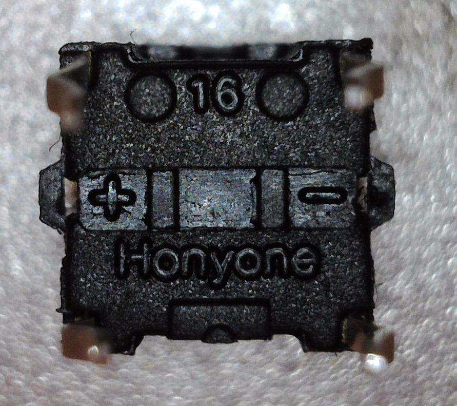

# Honyone LED Tact Switch TS05-2
## Inhaltsverzeichnis
1. [x] [Inhaltsverzeichnis](#Inhaltsverzeichnis)
1. [ ] [Beschreibung](#Beschreibung)
1. [ ] [Hardware](#Hardware)
   1. [ ] [Technische Daten](#technische-daten)
   1. [ ] [Datasheet](#datasheet)
   1. [ ] [PCB](#PCB)
1. [ ] [Software](#Software)
1. [ ] [3D](#3D)
1. [ ] [Where to buy](#Where-to-buy)
1. [ ] [Abbildungen](#Abbildungen)
1. [x] [Credits](#Credits)

## Beschreibung
LED-Switch (white, red(pink), green, blue)

## Hardware
[Honyone-Website](http://www.honyone.com/en/products/show_70.html)
### Technische Daten
* Modell: TS5-2TG-11S
* Function: Momentary
* Circuit: SPST 1P1T
* Current Rating: 50mA
* Solder Spec: 260 °C for 3 seconds
* Resistance: 100 mOhm
* Operating life: 200.000 Cycles minimum
* LCSC Part #: Honyone-products not available
* EAN / GTIN: not available

### Datasheet
* 
* 
### PCB
## Software
## 3D

## Where to buy
~ 21 EUR for 50pcs: [AliExpress Ruixue station Store](https://www.aliexpress.com/store/1418220)

## Abbildungen

[more pictures](images/)

## Credits
* :+1: [arduino](https://github.com/arduino)
* :+1: [adafruit](https://github.com/adafruit)
* :+1: [sparkfun](https://github.com/sparkfun)
* :+1: [Watterott](https://github.com/watterott) and @awatterott for great SW, HW and products
* :+1: [atom](https://github.com/atom)
* :+1: [mattahan](https://www.deviantart.com/mattahan) for the [Buuf graphics](https://www.deviantart.com/mattahan/art/Buuf-37966044)
* :+1: @ikatyang for the [emoji-cheat-sheet](https://github.com/ikatyang/emoji-cheat-sheet/blob/master/README.md)
